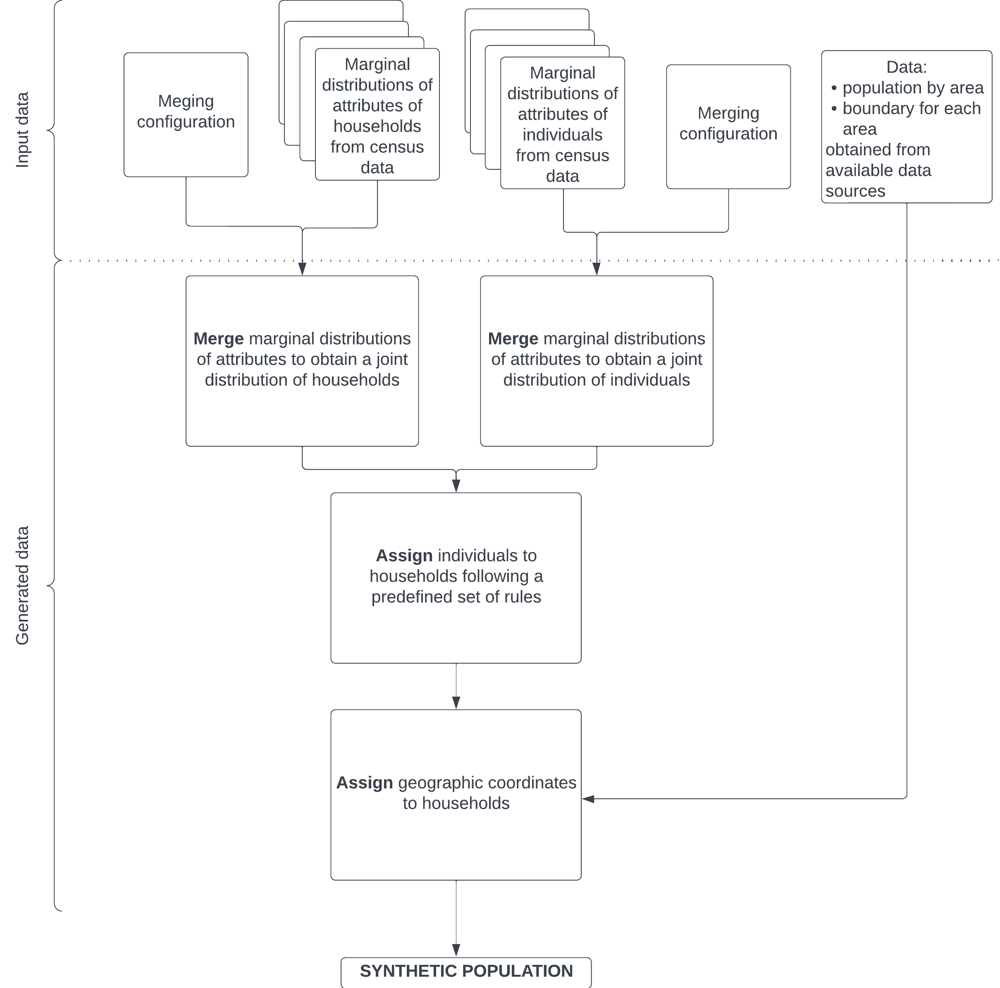

# SyntheticPopulation.jl

## Installation
```
using Pkg
Pkg.add(url = "https://github.com/mkloe/SyntheticPopulation.jl")
```

## Usage guide:
The synthetic population can be generated by following the process visualized below:



The exact data structure and functons called on each of the steps should be referenced from `/tutorial_notebooks/beijing_tutorial.ipynb`.

## Other useful information
- Notebook with tutorial is in `/tutorial_notebooks/beijing_tutorial.ipynb`.
- Tutorial for configuration of the algorithm is in `/tutorial_notebooks/config_tutorial.ipynb`.
- Detailed explanation of data structure used in the package is in `/tutorial_notebooks/dataframe_formats.ipynb`

## Repository structure
- `/src` - source code for the repository
- `/docs`- files for geneation of documentation with Documenter.jl
- `/test` - tests of the package
- `/tutorial_notebooks` - tutorials aiming to explain usage of the package
- `/validation_notebooks` - notebooks with some experiment on the generated population which were used for my Master's thesis
